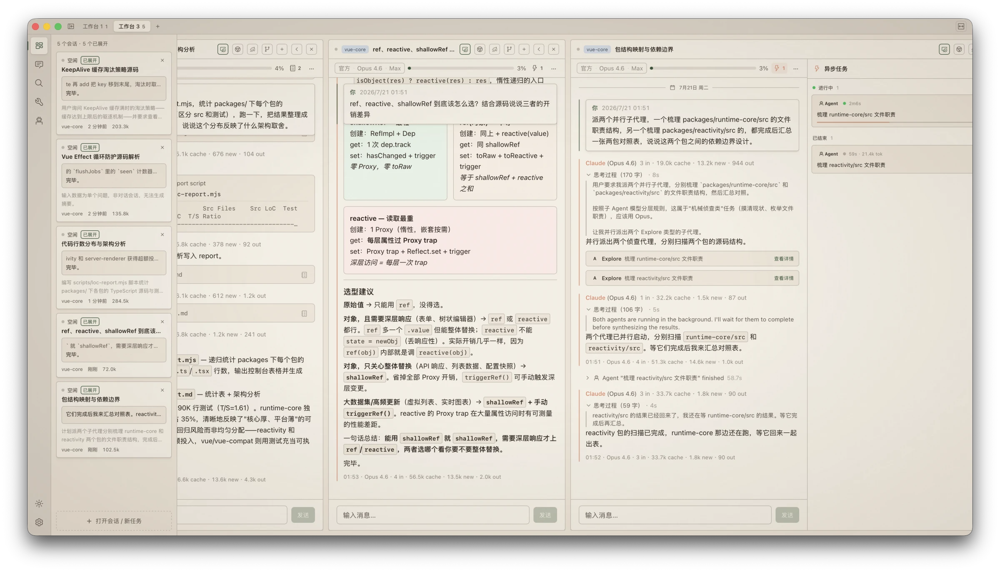

<p align="center">
  
</p>

<h1 align="center">Monet</h1>

<p align="center">
  Mission Control for <a href="https://docs.anthropic.com/en/docs/claude-code">Claude Code</a>
</p>

<p align="center">
  <a href="README.zh-CN.md">中文说明</a>
</p>

<p align="center">
  <a href="LICENSE"></a>
  <a href="https://github.com/zenolab124/monet/releases/latest"></a>
  <a href="https://github.com/zenolab124/monet/actions/workflows/ci.yml"></a>
</p>

<p align="center">
  
  
  
  
  
</p>

<p align="center">
  <a href="#features">Features</a> •
  <a href="#install">Install</a> •
  <a href="#build-from-source">Build</a> •
  <a href="#data--privacy">Privacy</a>
</p>

<p align="center">
  
</p>

## What is Monet?

A desktop app that turns your Claude Code session history into a browsable, searchable, and interactive workspace. Named after [Claude Monet](https://en.wikipedia.org/wiki/Claude_Monet) — yes, that Claude.

Monet **never writes** to Claude Code's JSONL files. All metadata is stored separately in `~/.monet/`.

## Why Monet?

- **Mission control, not just a viewer.** Run and monitor multiple agents in parallel — split columns, a live monitor rail, and inline permission approval. Command your agents like a trader watches the market.
- **Your data stays yours.** Read-only over Claude Code's files by architecture, fully offline, zero telemetry, no accounts. Everything Monet adds lives in its own directory.
- **It works while you sleep.** Cron routines run through the OS scheduler even when Monet is closed — your Mac can wake itself up, run the task, and go back to sleep.

## Features

### 🖥 Workbench — parallel agent control

- Multi-tab workspaces with draggable split columns; 5+ sessions streaming side by side without blocking each other
- Monitor rail: live status, tail output, and token usage for every session at a glance — approve permissions or retry right from the card
- **Race mode**: fork a session into parallel lanes, broadcast one prompt to different models/channels, and compare answers and token cost side by side
- Permission requests as GUI cards: dangerous commands get a red warning, AI annotates the risk in plain language; `Enter` to allow, `Esc` to deny
- Async task panel for subagents, workflows, and background tasks with live progress
- Sessions started in your terminal are detected, followed live, and tracked via official CLI hooks (Turn Signal)

### 📖 Reading experience

- True streaming — rendered from the CLI's character-level partial message events, with adaptive typewriter pacing
- Purpose-built cards for 18+ tool calls: Edit shows red/green diffs, Bash shows commands and exit codes, unknown tools degrade gracefully
- Inline HTML/SVG rendering in replies — comparison cards, tables, and diagrams instead of walls of text
- Paste or drag images into the input; thumbnails with a full-screen viewer
- Thinking blocks with word counts, anchor-dot navigation for long chats, sticky prompt headers, date dividers

### 🗄 Archive & search

- Three-pane read-only browser: projects → sessions → detail; watch a live session without touching it
- Full-text search across every project in milliseconds, plus an agent-powered semantic mode for fuzzy memories
- AI-generated titles, tags, and summaries — stored outside the JSONL, of course

### 📋 Transparency

- **File ledger**: exactly which files a session touched, a per-edit diff timeline, and a read-only git snapshot
- Per-turn token stats, cache hit rate, and a context-window usage bar that warns before you hit the ceiling

### ⚙️ Automation & system integration

- Cron routines executed by the OS scheduler (launchd) — they run even when Monet isn't open
- Wake-from-sleep: schedule overnight runs; one-time authorization, then fully silent
- Menu bar quota monitor: live session/weekly usage percentages and reset countdown
- Native WidgetKit desktop widgets: streaks, token pulse, work-rhythm heatmap, model mix, and more
- Built-in MCP server: search your session history and manage routines from inside any Claude Code CLI session

### 🎨 Craft & customization

- Paper design language — warm, matte, ink-on-paper; a dark Ink theme included
- 12 built-in languages, and AI can translate the entire UI into any other language you name
- Channels: official API, self-hosted proxies, OpenAI-protocol endpoints, even Apple's on-device models — switch per session
- Per-session model, thinking effort, and permission mode, all from a capsule in the session header

## Install

**Homebrew**:

```bash
brew tap zenolab124/tap
brew install --cask monet
```

Or download the latest `.dmg` from [Releases](../../releases).

> macOS only for now. Requires macOS 11+ (Apple Silicon).

**First launch**: Monet is signed with a stable identity but not yet notarized by Apple, so Gatekeeper will warn on first open. Right-click the app → **Open** (once), or run:

```bash
xattr -cr /Applications/Monet.app
```

After that, updates install silently in-app — no warnings again.

## Build from Source

### Prerequisites

- [Node.js](https://nodejs.org/) 22+
- [pnpm](https://pnpm.io/) 10+
- [Rust](https://rustup.rs/) 1.77+
- Xcode Command Line Tools — `xcode-select --install`

### Development

```bash
git clone https://github.com/zenolab124/monet.git
cd monet
pnpm install
pnpm tauri dev
```

### Release Build (with widget + signing)

```bash
pnpm release
```

This runs `tauri build`, compiles the macOS widget extension, embeds it into the app bundle, signs everything, and creates a `.dmg`.

To set up a local signing identity (recommended — keeps TCC permissions stable across rebuilds):

```bash
scripts/setup-signing.sh
```

Without it, the build falls back to ad-hoc signing — functional, but TCC permissions reset on each rebuild and widgets may not register.

## Data & Privacy

| What | Where | Access |
|------|-------|--------|
| Claude Code sessions | `~/.claude/projects/` | **Read-only** |
| Monet metadata (titles, tags, routines) | `~/.monet/` | Read-write |
| MCP registration | `~/.claude/settings.json` | Adds `monet` entry under `mcpServers` |

Monet is fully offline. No telemetry, no accounts, no network calls (except when you explicitly use streaming via Claude Code CLI).

## FAQ

**Does Monet replace the Claude Code CLI?**
No — it's a companion. The CLI does the work; Monet gives you eyes and hands over it. Sessions started in either place show up in both.

**Is my session data safe?**
Monet never writes to Claude Code's JSONL files — that's an architectural guarantee, not a setting. Titles, tags, and other extras live in `~/.monet/`. Delete Monet and your Claude Code data is untouched.

**Why does Gatekeeper warn on first launch?**
Monet is signed with a stable identity but not yet notarized by Apple. Right-click → Open once (or `xattr -cr /Applications/Monet.app`), and in-app updates are silent afterwards.

**Why does it ask for system permissions?**
Each permission serves one feature: Terminal automation for "resume in terminal"; accessibility and screen recording are only used when an agent task needs to operate the UI or observe the screen. The Settings page has a permission health-check panel showing exactly what's granted.

**What about Windows / Linux?**
macOS (Apple Silicon) is first. The stack (Tauri + Rust) is cross-platform and Windows support is on the roadmap.

## Tech Stack

- [Tauri 2](https://tauri.app/) — Rust backend + system WebView
- [Vue 3](https://vuejs.org/) + TypeScript + Composition API
- [UnoCSS](https://unocss.dev/) — Atomic CSS (preset-wind4 + preset-icons)
- [Shiki](https://shiki.style/) — Syntax highlighting
- [markdown-it](https://github.com/markdown-it/markdown-it) — Markdown rendering
- [vue-i18n](https://vue-i18n.intlify.dev/) — i18n
- [@dnd-kit/vue](https://dndkit.com/) — Drag and drop
- [Swift WidgetKit](https://developer.apple.com/documentation/widgetkit) — macOS widgets

## License

[MIT](LICENSE)
